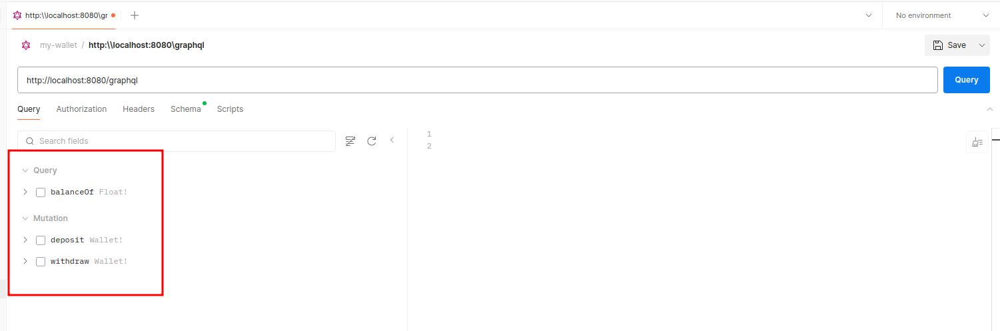
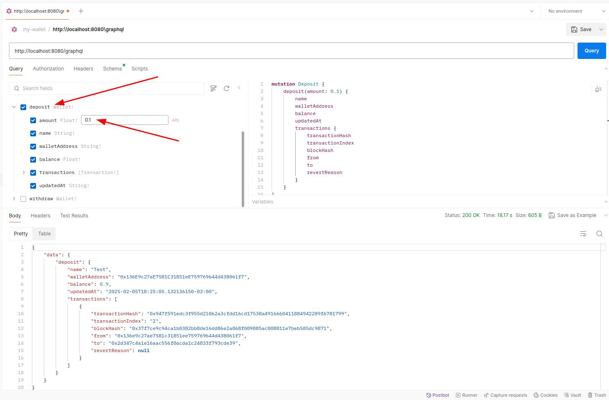
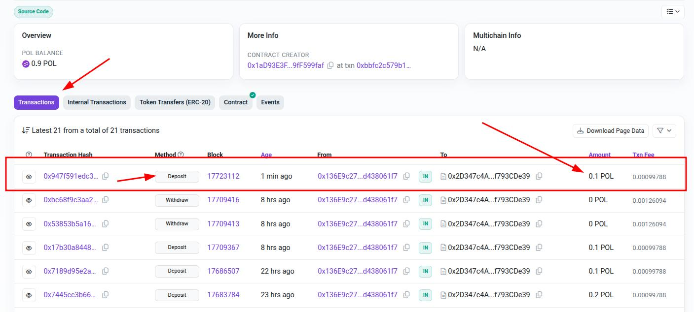
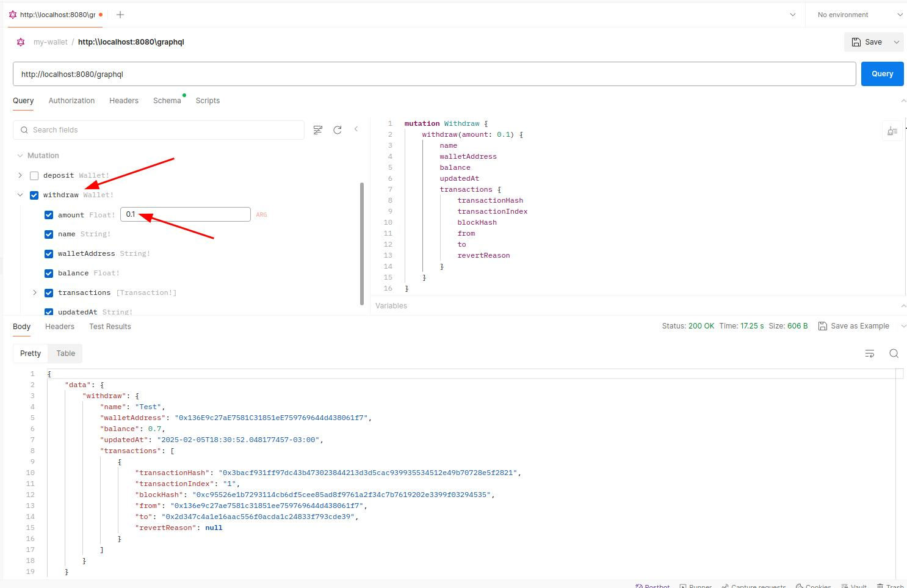
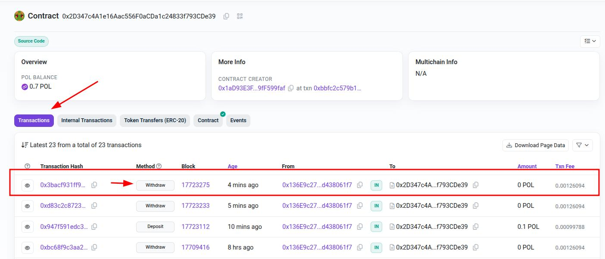
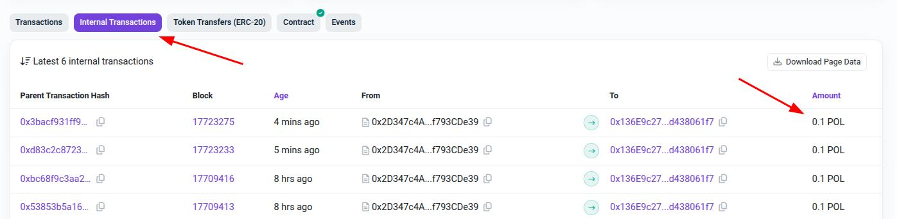
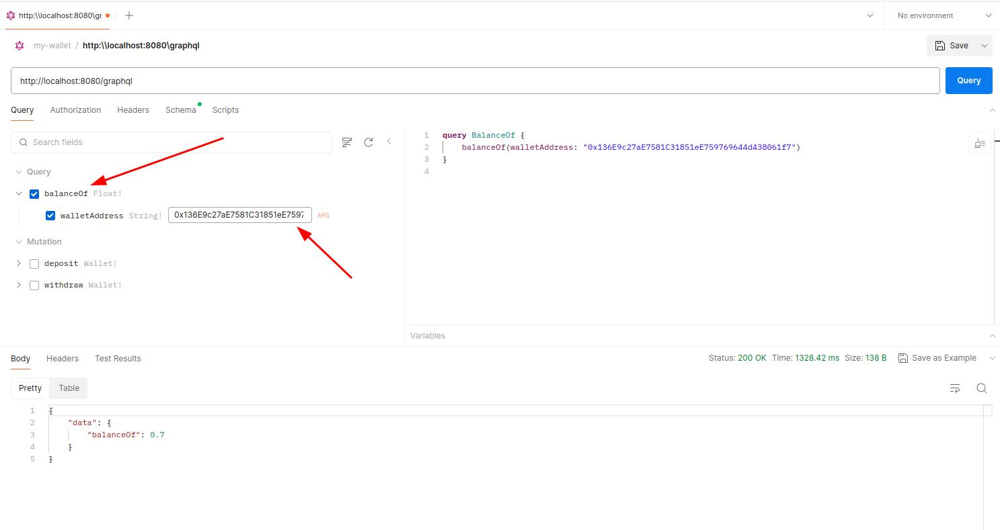

# MyWallet

## Descrição do Projeto

MyWallet é um projeto que combina tecnologia blockchain com um backend. O sistema é desenvolvido utilizando Solidity para o smart contract e um backend baseado em Spring Boot e Web3j para interagir com a blockchain.

## Tecnologias Utilizadas

### Blockchain
- **Solidity**: Linguagem de programação utilizada para desenvolver o smart contract `MyWallet`.
- **Hardhat**: Ferramenta de desenvolvimento para compilar, testar e implantar contratos Solidity.
- **Ethers.js**: Biblioteca JavaScript utilizada para interagir com a blockchain Ethereum.
- **Chai**: Framework de testes utilizado para validar o comportamento do contrato.

### Backend
- **Spring Boot**: Framework utilizado para estruturar o backend da aplicação.
- **Web3j**: Biblioteca Java para interação com a blockchain Ethereum.
- **GraphQL**: Tecnologia utilizada para criar uma API flexível e eficiente para o backend.

## Funcionalidades
- Depositar
- Sacar
- Consultar saldo

### Configure as variáveis de ambiente

**Blockchain:**
   - Crie um arquivo `.env` na raiz do projeto.
   - Utilize o arquivo `.env.example` como referência para inserir os valores necessários.
   
**Backend:**
- No arquivo `application.yml`, adicione:
  - A chave privada da carteira.
  - A API key da Infura.
  - O endereço do contrato, caso queira modificar.

 ## Exemplos de Execução

 

### Depósito
#### Postman

#### Smart Contract

### Saque
#### Postman

#### Smart Contract

### Consulta de Saldo
#### Postman

